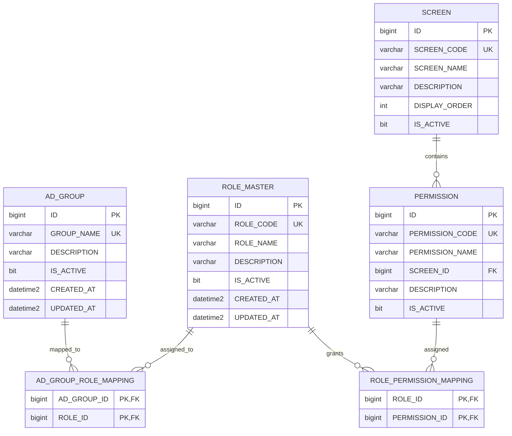

# RBAC table Design
Q: I need to desing database table for RBAC for storing AD group names, role name, screens and permissions.

Requierment:
we will ad groups like APP_EUY0_ECS_USER,APP_EUY0_ECS_SUPER_USER, APP_EUY0_ECS_ADMIN
and each wil have one to one association with roles
APP_EUY0_ECS_USER : USER_ROLE
APP_EUY0_ECS_SUPER_USER: SUPER_USER_ROLE
APP_EUY0_ECS_ADMIN: ADMN_ROLE

then we will have Screens and screencode
INACTIVE_EMPLOEES_MANAGMENT , name inactive empliyees managment
RECON_DASHBOARD_Managment, name reocnilicaiton dasboard managemt
etc..

and each screen will have permission like 
INACTIVE_EMPLOEES_MANAGMENT: VIEW_INACTIVE_EMPLOEES_MANAGMENT, UPDATE_INACTIVE_EMPLOEES_MANAGMENT

etc..
please suggest me table desing which looks simple and solve relation mapping issues here a role can have mutiple screen and permission and a permisoin can have multiple roles and role and AD group will remai same


For your requirement, keep the RBAC model **normalized and simple**. Since:

* AD Groups are mostly static
* 1 AD Group → 1 Role
* 1 Role → many Permissions
* 1 Screen → many Permissions
* 1 Permission → many Roles

the cleanest design is:

# Recommended RBAC Database Design

## 1. AD_GROUP

Stores Active Directory group names.

```sql
CREATE TABLE AD_GROUP (
    ID BIGINT IDENTITY(1,1) PRIMARY KEY,
    GROUP_NAME VARCHAR(200) NOT NULL UNIQUE,
    DESCRIPTION VARCHAR(500),
    IS_ACTIVE BIT NOT NULL DEFAULT 1,
    CREATED_AT DATETIME2 DEFAULT SYSDATETIME(),
    UPDATED_AT DATETIME2 DEFAULT SYSDATETIME()
);
```

Example:

| ID | GROUP_NAME              |
| -- | ----------------------- |
| 1  | APP_EUY0_ECS_USER       |
| 2  | APP_EUY0_ECS_SUPER_USER |
| 3  | APP_EUY0_ECS_ADMIN      |

---

## 2. ROLE

Stores application roles.

```sql
CREATE TABLE ROLE_MASTER (
    ID BIGINT IDENTITY(1,1) PRIMARY KEY,
    ROLE_CODE VARCHAR(100) NOT NULL UNIQUE,
    ROLE_NAME VARCHAR(200) NOT NULL,
    DESCRIPTION VARCHAR(500),
    IS_ACTIVE BIT NOT NULL DEFAULT 1,
    CREATED_AT DATETIME2 DEFAULT SYSDATETIME(),
    UPDATED_AT DATETIME2 DEFAULT SYSDATETIME()
);
```

Example:

| ID | ROLE_CODE       |
| -- | --------------- |
| 1  | USER_ROLE       |
| 2  | SUPER_USER_ROLE |
| 3  | ADMIN_ROLE      |

---

## 3. AD_GROUP_ROLE_MAPPING

Because today it's 1:1, but future may become many-to-many.

Do NOT hardcode 1:1 in schema.

```sql
CREATE TABLE AD_GROUP_ROLE_MAPPING (
    AD_GROUP_ID BIGINT NOT NULL,
    ROLE_ID BIGINT NOT NULL,

    PRIMARY KEY (AD_GROUP_ID, ROLE_ID),

    FOREIGN KEY (AD_GROUP_ID) REFERENCES AD_GROUP(ID),
    FOREIGN KEY (ROLE_ID) REFERENCES ROLE_MASTER(ID)
);
```

Example:

| AD_GROUP_ID | ROLE_ID |
| ----------- | ------- |
| 1           | 1       |
| 2           | 2       |
| 3           | 3       |

---

## 4. SCREEN

Stores UI screens/modules.

```sql
CREATE TABLE SCREEN (
    ID BIGINT IDENTITY(1,1) PRIMARY KEY,
    SCREEN_CODE VARCHAR(100) NOT NULL UNIQUE,
    SCREEN_NAME VARCHAR(200) NOT NULL,
    DESCRIPTION VARCHAR(500),
    DISPLAY_ORDER INT,
    IS_ACTIVE BIT NOT NULL DEFAULT 1
);
```

Example:

| SCREEN_CODE                   |
| ----------------------------- |
| INACTIVE_EMPLOYEES_MANAGEMENT |
| RECON_DASHBOARD_MANAGEMENT    |

---

## 5. PERMISSION

Each permission belongs to one screen.

```sql
CREATE TABLE PERMISSION (
    ID BIGINT IDENTITY(1,1) PRIMARY KEY,
    PERMISSION_CODE VARCHAR(150) NOT NULL UNIQUE,
    PERMISSION_NAME VARCHAR(200),
    SCREEN_ID BIGINT NOT NULL,
    DESCRIPTION VARCHAR(500),
    IS_ACTIVE BIT NOT NULL DEFAULT 1,

    FOREIGN KEY (SCREEN_ID) REFERENCES SCREEN(ID)
);
```

Examples:

| PERMISSION_CODE                      | SCREEN_ID |
| ------------------------------------ | --------- |
| VIEW_INACTIVE_EMPLOYEES_MANAGEMENT   | 1         |
| UPDATE_INACTIVE_EMPLOYEES_MANAGEMENT | 1         |
| VIEW_RECON_DASHBOARD                 | 2         |
| EXPORT_RECON_DASHBOARD               | 2         |

---

## 6. ROLE_PERMISSION_MAPPING

Many-to-many between role and permission.

```sql
CREATE TABLE ROLE_PERMISSION_MAPPING (
    ROLE_ID BIGINT NOT NULL,
    PERMISSION_ID BIGINT NOT NULL,

    PRIMARY KEY (ROLE_ID, PERMISSION_ID),

    FOREIGN KEY (ROLE_ID) REFERENCES ROLE_MASTER(ID),
    FOREIGN KEY (PERMISSION_ID) REFERENCES PERMISSION(ID)
);
```

---

# ER Relationship

```text
AD_GROUP
   |
   | (many-to-many, currently 1:1)
   |
AD_GROUP_ROLE_MAPPING
   |
ROLE_MASTER
   |
   | (many-to-many)
   |
ROLE_PERMISSION_MAPPING
   |
PERMISSION
   |
   | (many-to-one)
   |
SCREEN
```

---

# Example Flow

User logs in:

AD token contains:

```text
groups:
APP_EUY0_ECS_SUPER_USER
```

Lookup:

```sql
AD_GROUP -> ROLE
```

Result:

```text
SUPER_USER_ROLE
```

Then:

```sql
ROLE -> PERMISSIONS
```

Result:

```text
VIEW_INACTIVE_EMPLOYEES_MANAGEMENT
UPDATE_INACTIVE_EMPLOYEES_MANAGEMENT
VIEW_RECON_DASHBOARD
EXPORT_RECON_DASHBOARD
```

Frontend can use permissions like:

```javascript
if (hasPermission('UPDATE_INACTIVE_EMPLOYEES_MANAGEMENT'))
```

Backend:

```java
@PreAuthorize("hasAuthority('UPDATE_INACTIVE_EMPLOYEES_MANAGEMENT')")
```

---

# Why this design is good

### Simple

Only 6 tables.

---

### Flexible

Future changes supported:

* one AD group → multiple roles
* one role → multiple AD groups
* new screens
* new permissions

without schema changes.

---

### Clean normalization

No duplicated permission strings.

---

### Spring Security friendly

Permission codes directly become authorities.

Example:

```java
GrantedAuthority authority =
    new SimpleGrantedAuthority("UPDATE_INACTIVE_EMPLOYEES_MANAGEMENT");
```

---

# One improvement (recommended naming)

Instead of:

```text
VIEW_INACTIVE_EMPLOYEES_MANAGEMENT
```

prefer:

```text
INACTIVE_EMPLOYEES:VIEW
INACTIVE_EMPLOYEES:UPDATE
RECON_DASHBOARD:VIEW
RECON_DASHBOARD:EXPORT
```

Because:

* shorter
* cleaner
* easier querying
* easier frontend checks
* avoids huge names

Then backend:

```java
@PreAuthorize("hasAuthority('INACTIVE_EMPLOYEES:UPDATE')")
```

This is a cleaner enterprise RBAC style.

---

For your Spring Boot + SQL Server + AD integration use case, this is the design I would recommend.


Q:please generate ER daigmra in mermaid syntax and give me insert data with example

Here is the full ER diagram in **Mermaid syntax** plus sample insert data for your RBAC model.

# ER Diagram (Mermaid)



---

# Sample Insert Data

## 1. AD Groups

```sql
INSERT INTO AD_GROUP (GROUP_NAME, DESCRIPTION)
VALUES
('APP_EUY0_ECS_USER', 'Normal ECS users'),
('APP_EUY0_ECS_SUPER_USER', 'Super ECS users'),
('APP_EUY0_ECS_ADMIN', 'ECS administrators');
```

---

## 2. Roles

```sql
INSERT INTO ROLE_MASTER (ROLE_CODE, ROLE_NAME, DESCRIPTION)
VALUES
('USER_ROLE', 'User Role', 'Standard user role'),
('SUPER_USER_ROLE', 'Super User Role', 'Advanced user role'),
('ADMIN_ROLE', 'Admin Role', 'Administrator role');
```

---

## 3. AD Group to Role Mapping

Assuming IDs are generated as 1,2,3.

```sql
INSERT INTO AD_GROUP_ROLE_MAPPING (AD_GROUP_ID, ROLE_ID)
VALUES
(1, 1), -- APP_EUY0_ECS_USER -> USER_ROLE
(2, 2), -- APP_EUY0_ECS_SUPER_USER -> SUPER_USER_ROLE
(3, 3); -- APP_EUY0_ECS_ADMIN -> ADMIN_ROLE
```

---

## 4. Screens

```sql
INSERT INTO SCREEN
(SCREEN_CODE, SCREEN_NAME, DESCRIPTION, DISPLAY_ORDER)
VALUES
(
    'INACTIVE_EMPLOYEES',
    'Inactive Employees Management',
    'Manage inactive employees',
    1
),
(
    'RECON_DASHBOARD',
    'Reconciliation Dashboard',
    'Dashboard for reconciliation monitoring',
    2
),
(
    'ALERT_MANAGEMENT',
    'Alert Management',
    'Manage alerts',
    3
);
```

---

## 5. Permissions

```sql
INSERT INTO PERMISSION
(PERMISSION_CODE, PERMISSION_NAME, SCREEN_ID, DESCRIPTION)
VALUES

('INACTIVE_EMPLOYEES:VIEW', 'View Inactive Employees', 1, 'View access'),
('INACTIVE_EMPLOYEES:UPDATE', 'Update Inactive Employees', 1, 'Update access'),

('RECON_DASHBOARD:VIEW', 'View Dashboard', 2, 'Dashboard access'),
('RECON_DASHBOARD:EXPORT', 'Export Dashboard', 2, 'Export dashboard data'),

('ALERT_MANAGEMENT:VIEW', 'View Alerts', 3, 'View alerts'),
('ALERT_MANAGEMENT:CREATE', 'Create Alerts', 3, 'Create alerts'),
('ALERT_MANAGEMENT:UPDATE', 'Update Alerts', 3, 'Update alerts'),
('ALERT_MANAGEMENT:DELETE', 'Delete Alerts', 3, 'Delete alerts');
```

---

## 6. Role Permission Mapping

### USER_ROLE

Basic user gets only view access.

```sql
INSERT INTO ROLE_PERMISSION_MAPPING (ROLE_ID, PERMISSION_ID)
VALUES
(1, 1), -- INACTIVE_EMPLOYEES:VIEW
(1, 3), -- RECON_DASHBOARD:VIEW
(1, 5); -- ALERT_MANAGEMENT:VIEW
```

---

### SUPER_USER_ROLE

Super user gets create/update access.

```sql
INSERT INTO ROLE_PERMISSION_MAPPING (ROLE_ID, PERMISSION_ID)
VALUES
(2, 1),
(2, 2),
(2, 3),
(2, 4),
(2, 5),
(2, 6),
(2, 7);
```

---

### ADMIN_ROLE

Admin gets everything.

```sql
INSERT INTO ROLE_PERMISSION_MAPPING (ROLE_ID, PERMISSION_ID)
VALUES
(3, 1),
(3, 2),
(3, 3),
(3, 4),
(3, 5),
(3, 6),
(3, 7),
(3, 8);
```

---

# Example Final Data Meaning

## APP_EUY0_ECS_USER

gets:

```text
USER_ROLE
```

permissions:

```text
INACTIVE_EMPLOYEES:VIEW
RECON_DASHBOARD:VIEW
ALERT_MANAGEMENT:VIEW
```

---

## APP_EUY0_ECS_SUPER_USER

gets:

```text
SUPER_USER_ROLE
```

permissions:

```text
INACTIVE_EMPLOYEES:VIEW
INACTIVE_EMPLOYEES:UPDATE
RECON_DASHBOARD:VIEW
RECON_DASHBOARD:EXPORT
ALERT_MANAGEMENT:VIEW
ALERT_MANAGEMENT:CREATE
ALERT_MANAGEMENT:UPDATE
```

---

## APP_EUY0_ECS_ADMIN

gets:

```text
ADMIN_ROLE
```

permissions:

```text
all permissions
```

---

# Login Query Example

If token contains:

```text
APP_EUY0_ECS_SUPER_USER
```

query:

```sql
SELECT DISTINCT p.PERMISSION_CODE
FROM AD_GROUP ag
JOIN AD_GROUP_ROLE_MAPPING agr
    ON ag.ID = agr.AD_GROUP_ID
JOIN ROLE_MASTER r
    ON agr.ROLE_ID = r.ID
JOIN ROLE_PERMISSION_MAPPING rpm
    ON r.ID = rpm.ROLE_ID
JOIN PERMISSION p
    ON rpm.PERMISSION_ID = p.ID
WHERE ag.GROUP_NAME = 'APP_EUY0_ECS_SUPER_USER'
  AND ag.IS_ACTIVE = 1
  AND r.IS_ACTIVE = 1
  AND p.IS_ACTIVE = 1;
```

Result:

```text
INACTIVE_EMPLOYEES:VIEW
INACTIVE_EMPLOYEES:UPDATE
RECON_DASHBOARD:VIEW
RECON_DASHBOARD:EXPORT
ALERT_MANAGEMENT:VIEW
ALERT_MANAGEMENT:CREATE
ALERT_MANAGEMENT:UPDATE
```

This maps directly into Spring Security `GrantedAuthority`.


I am using SQL db server
