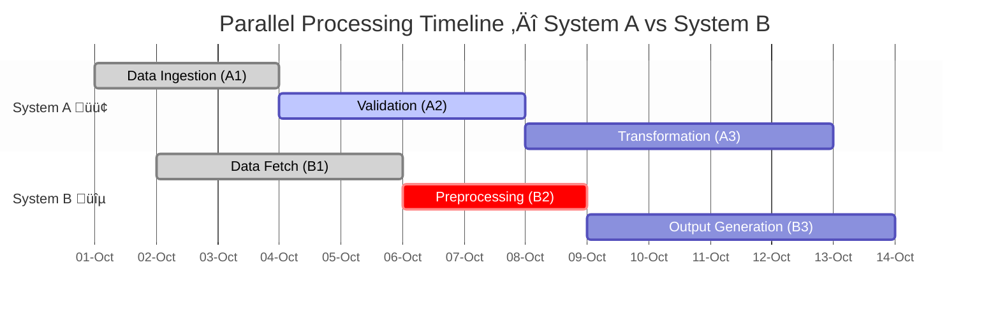

# JD_Stratus_Share

### Schema
```sql
SELECT 
    fk.name AS ForeignKey,
    tp.name AS ParentTable,
    cp.name AS ParentColumn,
    tr.name AS ReferencedTable,
    cr.name AS ReferencedColumn
FROM sys.foreign_keys fk
JOIN sys.tables tp ON fk.parent_object_id = tp.object_id
JOIN sys.tables tr ON fk.referenced_object_id = tr.object_id
JOIN sys.foreign_key_columns fkc ON fkc.constraint_object_id = fk.object_id
JOIN sys.columns cp ON fkc.parent_column_id = cp.column_id AND fkc.parent_object_id = cp.object_id
JOIN sys.columns cr ON fkc.referenced_column_id = cr.column_id AND fkc.referenced_object_id = cr.object_id
ORDER BY ParentTable, ReferencedTable;
```
You need a **Java reflection-based utility** that scans your class, detects all fields (including nested objects), and **generates a builder pattern-based object creation code as a `String`**.  

---

### **üìå Solution Overview**
1. **Use reflection** to iterate over fields of the provided class.
2. **Detect primitive types, wrapper classes, and nested objects.**
3. **Generate a Java code string** that initializes the object using the Builder pattern.
4. **Recursively generate values for nested objects.**
5. **Return a `String` containing the builder-based instantiation code.**

---

### **‚úÖ Java Code: Generate Object Creation Code Dynamically**
```java
import java.lang.reflect.Field;
import java.lang.reflect.Method;
import java.util.Random;

public class BuilderCodeGenerator {

    public static String generateBuilderCode(Class<?> clazz, String variableName) {
        StringBuilder sb = new StringBuilder();
        sb.append(clazz.getSimpleName()).append(" ").append(variableName).append(" = ")
                .append(clazz.getSimpleName()).append(".builder()\n");

        for (Field field : clazz.getDeclaredFields()) {
            field.setAccessible(true);
            String fieldName = field.getName();
            Class<?> fieldType = field.getType();

            String value = getDefaultValueCode(fieldType, fieldName);
            sb.append("    .").append("with").append(capitalize(fieldName)).append("(").append(value).append(")\n");
        }

        sb.append("    .build();\n");
        return sb.toString();
    }

    private static String getDefaultValueCode(Class<?> type, String fieldName) {
        if (type.equals(String.class)) {
            return "\"" + fieldName + "_default\"";
        } else if (type.equals(int.class) || type.equals(Integer.class)) {
            return "100";
        } else if (type.equals(long.class) || type.equals(Long.class)) {
            return "100L";
        } else if (type.equals(boolean.class) || type.equals(Boolean.class)) {
            return "true";
        } else if (type.equals(double.class) || type.equals(Double.class)) {
            return "10.5";
        } else if (type.isEnum()) {
            return type.getSimpleName() + ".values()[0]"; // Use first enum value
        } else {
            // Nested object case (Recursive Call)
            return generateBuilderCode(type, fieldName + "Obj");
        }
    }

    private static String capitalize(String str) {
        return str.substring(0, 1).toUpperCase() + str.substring(1);
    }

    public static void main(String[] args) {
        // Example usage with a sample class
        String builderCode = generateBuilderCode(Transaction.class, "transaction");
        System.out.println(builderCode);
    }
}
```

---

### **‚úÖ Example Class: `Transaction`**
```java
public class Transaction {
    private String transactionId;
    private int amount;
    private User user; // Nested object

    public static Builder builder() { return new Builder(); }

    public static class Builder {
        private String transactionId;
        private int amount;
        private User user;

        public Builder withTransactionId(String transactionId) { this.transactionId = transactionId; return this; }
        public Builder withAmount(int amount) { this.amount = amount; return this; }
        public Builder withUser(User user) { this.user = user; return this; }

        public Transaction build() { return new Transaction(transactionId, amount, user); }
    }
}
```

---

### **‚úÖ Example Class: `User` (Nested Object)**
```java
public class User {
    private String username;
    private int age;

    public static Builder builder() { return new Builder(); }

    public static class Builder {
        private String username;
        private int age;

        public Builder withUsername(String username) { this.username = username; return this; }
        public Builder withAge(int age) { this.age = age; return this; }

        public User build() { return new User(username, age); }
    }
}
```

---

### **‚úÖ Generated Code Output**
When you run the `main()` method, this **automatically generated** builder code prints:
```java
Transaction transaction = Transaction.builder()
    .withTransactionId("transactionId_default")
    .withAmount(100)
    .withUser(User.builder()
        .withUsername("username_default")
        .withAge(100)
        .build())
    .build();
```
---
### **üîπ Key Features**
‚úî **Dynamically generates builder code** for **any** class.  
‚úî **Handles nested objects** recursively.  
‚úî **Uses default values** for each field (string, numbers, enums, booleans).  
‚úî **Outputs valid Java code** that can be copy-pasted.  

Would you like any enhancements? üöÄ
----

### Vault Secret 

To securely inject a key-value (K/V) secret from HashiCorp Vault into your Kubernetes deployment using the Vault Agent Injector and subsequently create a Kubernetes Secret from this data, follow the steps outlined below:

**1. Store Your Application YAML in Vault:**

First, ensure that your application's YAML configuration is stored as a secret in Vault. For instance, if your secret's key is `config.secret` and it contains your entire application YAML, you can store it using the following command:

```bash
vault kv put secret/config config.secret=@app-config.yaml
```


Here, `app-config.yaml` is your application's configuration file.

**2. Create a Vault Policy:**

Define a Vault policy that grants read access to the secret. Save the policy in a file named `app-policy.hcl`:

```hcl
path "secret/data/config" {
  capabilities = ["read"]
}
```


Apply the policy in Vault:

```bash
vault policy write app-policy app-policy.hcl
```


**3. Enable Kubernetes Authentication in Vault:**

Configure Vault to authenticate using Kubernetes:

```bash
vault auth enable kubernetes
```


Retrieve the Kubernetes API server URL:

```bash
KUBE_API_SERVER=$(kubectl config view --raw --minify --flatten -o json | jq -r '.clusters[0].cluster.server')
```


Obtain the JWT token from the Kubernetes service account:

```bash
SERVICE_ACCOUNT_NAME=vault-auth
SECRET_NAME=$(kubectl get sa $SERVICE_ACCOUNT_NAME -o jsonpath="{.secrets[0].name}")
SA_JWT_TOKEN=$(kubectl get secret $SECRET_NAME -o jsonpath="{.data.token}" | base64 --decode)
```


Retrieve the Kubernetes CA certificate:

```bash
KUBE_CA_CERT=$(kubectl get secret $SECRET_NAME -o jsonpath="{.data['ca\.crt']}" | base64 --decode)
```


Configure Vault with the Kubernetes authentication details:

```bash
vault write auth/kubernetes/config \
    token_reviewer_jwt="$SA_JWT_TOKEN" \
    kubernetes_host="$KUBE_API_SERVER" \
    kubernetes_ca_cert="$KUBE_CA_CERT"
```


**4. Create a Vault Role:**

Bind the Kubernetes service account to the Vault policy:

```bash
vault write auth/kubernetes/role/app-role \
    bound_service_account_names=vault-auth \
    bound_service_account_namespaces=default \
    policies=app-policy \
    ttl=24h
```


**5. Deploy the Vault Agent Injector:**

Ensure that the Vault Agent Injector is deployed in your Kubernetes cluster. This can be done using the Vault Helm chart:

```bash
helm install vault hashicorp/vault --set "server.dev.enabled=true"
```


**6. Annotate Your Kubernetes Deployment:**

Modify your Kubernetes deployment to include annotations that instruct the Vault Agent Injector to retrieve the secret and create a Kubernetes Secret. Here's an example of how to set this up:

```yaml
apiVersion: apps/v1
kind: Deployment
metadata:
  name: my-app
  annotations:
    vault.hashicorp.com/agent-inject: 'true'
    vault.hashicorp.com/role: 'app-role'
    vault.hashicorp.com/agent-inject-secret-config: 'secret/data/config'
    vault.hashicorp.com/agent-inject-template-config: |
      {{- with secret "secret/data/config" -}}
      apiVersion: v1
      kind: Secret
      metadata:
        name: app-config-secret
      type: Opaque
      data:
        config.yaml: {{ .Data.data.config.secret | base64Encode }}
      {{- end -}}
spec:
  replicas: 1
  selector:
    matchLabels:
      app: my-app
  template:
    metadata:
      labels:
        app: my-app
    spec:
      serviceAccountName: vault-auth
      containers:
        - name: my-app-container
          image: my-app-image
          volumeMounts:
            - name: app-config
              mountPath: /etc/app-config
              readOnly: true
      volumes:
        - name: app-config
          secret:
            secretName: app-config-secret
```


**Explanation:**

- `vault.hashicorp.com/agent-inject: 'true'`: Enables the Vault Agent Injector for this pod.

- `vault.hashicorp.com/role: 'app-role'`: Specifies the Vault role to use for authentication.

- `vault.hashicorp.com/agent-inject-secret-config: 'secret/data/config'`: Indicates the path to the Vault secret.

- `vault.hashicorp.com/agent-inject-template-config`: Utilizes a Vault Agent template to render the secret as a Kubernetes Secret manifest. The `config.secret` is base64 encoded to meet Kubernetes Secret requirements.

When the pod is deployed, the Vault Agent Injector will:

1. Authenticate to Vault using the specified role.

2. Retrieve the secret from Vault.

3. Render the secret into a Kubernetes Secret manifest using the provided template.

4. Apply the Kubernetes Secret to the cluster.

5. Mount the newly created Kubernetes Secret as a volume in the application container.

**7. Deploy Your Application:**

Apply your deployment configuration:

```bash
kubectl apply -f my-app-deployment.yaml
```


This setup ensures that your application's YAML configuration stored in Vault is securely injected into your Kubernetes deployment and made available as a Kubernetes Secret.

For more detailed information, refer to the [Vault Agent Injector documentation](https://developer.hashicorp.com/vault/docs/platform/k8s/injector). 

Yes, you can mount your additional Secret into a different volume within the same Pod. In Kubernetes, each volume is mounted to a unique directory within the container's filesystem. If your existing Secret is already mounted to a specific directory, you can mount the new Secret to a separate directory without any conflicts.

**Example: Mounting Multiple Secrets to Different Directories**

Here's how you can define a Pod specification to mount multiple Secrets into separate directories:

```yaml
apiVersion: v1
kind: Pod
metadata:
  name: my-pod
spec:
  containers:
    - name: my-container
      image: my-image
      volumeMounts:
        - name: existing-secret-volume
          mountPath: /etc/existing-secret
        - name: new-secret-volume
          mountPath: /etc/new-secret
  volumes:
    - name: existing-secret-volume
      secret:
        secretName: existing-secret
    - name: new-secret-volume
      secret:
        secretName: new-secret
```


In this configuration:

- The `existing-secret` is mounted to `/etc/existing-secret`.

- The `new-secret` is mounted to `/etc/new-secret`.

This approach ensures that each Secret is accessible within its designated directory in the container's filesystem.

**Considerations:**

- **Unique Mount Paths:** Ensure that each volume has a unique `mountPath` to prevent conflicts.

- **Access Permissions:** Verify that the application running in the Pod has the necessary permissions to access the mounted Secret files.

By mounting each Secret to a separate directory, you can effectively manage multiple Secrets within your Kubernetes Pods, ensuring that your applications have access to all necessary sensitive data without encountering mounting conflicts. 


```sh

#!/bin/bash

# Set variables
SECRET_FILE="config/secret.yml"
NAMESPACE="default"  # Change this if needed

# Function to log messages with timestamp
log() {
    echo "$(date '+%Y-%m-%d %H:%M:%S') - $1"
}

# Check if kubectl is installed
if ! command -v kubectl &> /dev/null; then
    log "‚ùå ERROR: kubectl command not found. Please install Kubernetes CLI."
    exit 1
fi

# Check if secret.yml file exists
if [ ! -f "$SECRET_FILE" ]; then
    log "‚ùå ERROR: Secret file '$SECRET_FILE' not found!"
    exit 1
fi

# Apply the secret using kubectl
log "üöÄ Applying Kubernetes secret from '$SECRET_FILE'..."
kubectl apply -f "$SECRET_FILE" --namespace="$NAMESPACE"

# Check if the secret was applied successfully
if [ $? -eq 0 ]; then
    log "‚úÖ SUCCESS: Secret applied successfully!"
else
    log "‚ùå ERROR: Failed to apply secret!"
    exit 1
fi
```

```python
from kubernetes import client, config

def apply_secret():
    config.load_incluster_config()  # Load in-cluster Kubernetes config
    api_instance = client.CoreV1Api()

    with open("/opt/asd/asd/config/secret.yml", "r") as f:
        secret_yaml = yaml.safe_load(f)

    api_instance.create_namespaced_secret(
        namespace="default",
        body=secret_yaml
    )

apply_secret_task = PythonOperator(
    task_id="apply_secret_python",
    python_callable=apply_secret,
)

```

```java
public void convertJsonToJavaClass(URL inputJsonUrl, File outputJavaClassDirectory, String packageName, String javaClassName) 
  throws IOException {
    JCodeModel jcodeModel = new JCodeModel();

    GenerationConfig config = new DefaultGenerationConfig() {
        @Override
        public boolean isGenerateBuilders() {
            return true;
        }

        @Override
        public SourceType getSourceType() {
            return SourceType.JSON;
        }
    };

    SchemaMapper mapper = new SchemaMapper(new RuleFactory(config, new Jackson2Annotator(config), new SchemaStore()), new SchemaGenerator());
    mapper.generate(jcodeModel, javaClassName, packageName, inputJsonUrl);

    jcodeModel.build(outputJavaClassDirectory);
}
```

```txt
Here’s your email rewritten in a polite and professional manner:  

---

**Subject:** Urgent Concern Regarding Incorrect PF Date of Joining  

Dear [Recipient's Name],  

I hope you are doing well.  

I am writing to raise a serious concern regarding my PF details. As you know, I joined IRIS on **January 17, 2025**. Due to delays in receiving my laptop and completing other onboarding trainings and formalities, I was unable to submit my PF details on time. However, I submitted all the required documents within five days.  

Despite multiple follow-ups on the email thread, I did not receive any response from the onboarding team, and the StoHM portal remained inactive for PF declaration. As a result, I had to raise a support ticket (**#75031**) on the support hub. After several follow-ups, I finally received a response from the finance team stating that my PF details would be updated in February.  

Upon checking the UAN portal in February, I noticed that my PF details were updated; however, my **Date of Joining (DOJ) was incorrectly recorded as February 1, 2025**, instead of my actual joining date, **January 17, 2025**. As per the regulations, my organization's Date of Joining and PF Date of Joining must be the same. If this discrepancy is not corrected, it could create problems for me in the future.  

To address this issue, I raised another ticket on **March 10** to request the correction. However, I was informed that the **UAN Date of Joining cannot be updated**. When I checked the UAN portal, I found that the **Date of Joining can be corrected through a Joint Declaration process**, but the finance team has denied this option.  

I kindly request your assistance in rectifying this issue at the earliest. Please let me know the next steps and how we can proceed with the correction. Your prompt support in resolving this matter would be greatly appreciated.  

Looking forward to your response.  

Best regards,  
[Your Name]  
[Your Employee ID]  
[Your Contact Information]

-----
```yaml
apiVersion: apps/v1
kind: Deployment
metadata:
  name: my-app
  namespace: my-namespace
  annotations:
    vault.hashicorp.com/agent-inject: "true"
    vault.hashicorp.com/agent-inject-secret-secret.yaml: "secret/k8s-secrets"
    vault.hashicorp.com/agent-inject-template-secret.yaml: |
      {{- with secret "secret/k8s-secrets" -}}
      {{ .Data.data.secret.yaml }}
      {{- end }}
spec:
  replicas: 1
  selector:
    matchLabels:
      app: my-app
  template:
    metadata:
      labels:
        app: my-app
    spec:
      serviceAccountName: vault-sa
      initContainers:
        - name: apply-secrets
          image: bitnami/kubectl:latest
          command:
            - "/bin/sh"
            - "-c"
            - |
              echo "Applying secrets..."
              kubectl apply -f /vault/secrets/secret.yaml
          volumeMounts:
            - name: vault-secret
              mountPath: /vault/secrets
      containers:
        - name: my-app
          image: my-app-image:latest
          volumeMounts:
            - name: vault-secret
              mountPath: /vault/secrets
      volumes:
        - name: vault-secret
          emptyDir: {}
```
---

### Safly loggin configuration in console

Sure! Here's a **complete example** of a `Spring Boot application.yml` file along with the safe key configuration and nested properties, followed by the final Java class to log only **non-sensitive keys** at startup.


- ‚úÖ `application.yml` (Complete Example)

```yaml
server:
  port: 8080

smarsh:
  dig:
    API:
      host: "api.smarsh.com"
      user: "rbds"
      pass: "superSecret"

myapp:
  service:
    endpoint: "https://internal.service.com"
    api-key: "should-not-log"
    region: "us-east-1"

db:
  username: "app_user"
  password: "hidden_secret"

logging:
  safe-keys:
    - smarsh.dig.API.host
    - smarsh.dig.API.user
    - myapp.service.endpoint
    - myapp.service.region
    - db.username
```


- ‚úÖ Java Component to Log Only Safe Keys

```java
import jakarta.annotation.PostConstruct;
import lombok.extern.slf4j.Slf4j;
import org.springframework.beans.factory.annotation.Value;
import org.springframework.core.env.Environment;
import org.springframework.stereotype.Component;

import java.util.List;

@Slf4j
@Component
public class SafePropertyLogger {

    private final Environment environment;
    private final List<String> safeKeys;

    public SafePropertyLogger(Environment environment,
                              @Value("${logging.safe-keys}") List<String> safeKeys) {
        this.environment = environment;
        this.safeKeys = safeKeys;
    }

    @PostConstruct
    public void logSafeProperties() {
        log.info("----- Safe Application Properties -----");
        for (String key : safeKeys) {
            String value = environment.getProperty(key);
            if (value != null) {
                log.info("{} = {}", key, value);
            } else {
                log.warn("{} is not set or not found", key);
            }
        }
        log.info("----------------------------------------");
    }
}
```


- ‚úÖ Output (Logged at Startup)

```
----- Safe Application Properties -----
smarsh.dig.API.host = api.smarsh.com
smarsh.dig.API.user = rbds
myapp.service.endpoint = https://internal.service.com
myapp.service.region = us-east-1
db.username = app_user
----------------------------------------
```


- üîí Sensitive values like `smarsh.dig.API.pass`, `myapp.service.api-key`, and `db.password` are **not logged**, even though they exist.


- 🧠 This Solution Is:
- **Generic**: You just maintain a list of safe keys in `application.yml`.
- **Secure**: Nothing sensitive is logged unless explicitly allowed.
- **Simple**: No need to manage nested object bindings or reflection.

Would you like to expand this to log all safe keys from a **given prefix** (e.g., everything under `smarsh.dig.API`) except sensitive keywords?

---
## S3 Bucket operations
If you're dealing with **a large number of files in an S3 bucket** and tools like **Cyberduck are too slow or crash**, you have a few better options to **search or filter files by name** (like using `LIKE` operations or prefix matching):


### ‚úÖ Recommended Options to Search S3 Files

#### **1. Use AWS CLI with Wildcard or Prefix Matching**

The AWS CLI is highly efficient and supports basic filtering.

```bash
aws s3 ls s3://your-bucket-name/path/to/files/ --recursive | grep 'your_search_term'
```

* You can pipe it through `grep` for partial name matches.
* This is memory-efficient and much faster than UI tools.


#### **2. Use S3 Select with Filtering (for content)**

If you're trying to **search inside the content** of large files (e.g., CSV or JSON), you can use **S3 Select** to query within the file without downloading it.

Example for CSV:

```bash
aws s3api select-object-content \
    --bucket your-bucket \
    --key your-file.csv \
    --expression "SELECT * FROM S3Object s WHERE s.column = 'value'" \
    --expression-type SQL \
    --input-serialization '{"CSV": {"FileHeaderInfo": "USE"}, "CompressionType": "NONE"}' \
    --output-serialization '{"CSV": {}}' output.txt
```

---

#### **3. Use Amazon S3 Inventory**

If you want to **search across millions of objects**, enable [S3 Inventory](https://docs.aws.amazon.com/AmazonS3/latest/userguide/storage-inventory.html):

* S3 generates a **daily or weekly CSV/ORC listing** of all your objects (names, sizes, timestamps, etc.).
* You can load this into Athena or a database and query efficiently using SQL-like queries.


#### **4. Use Amazon Athena on S3**

If you’ve enabled S3 Inventory or if your object listing is exported to S3:

* Create an **Athena table** over that inventory file.
* Run queries like:

  ```sql
  SELECT * FROM s3_inventory_table WHERE key LIKE '%myfilepart%'
  ```


#### **5. Use Boto3/Python Script (Advanced Control)**

If you're comfortable with scripting, this Python snippet helps scan with filtering:

```python
import boto3

s3 = boto3.client('s3')
paginator = s3.get_paginator('list_objects_v2')
bucket = 'your-bucket-name'
prefix = 'folder/'  # Optional

for page in paginator.paginate(Bucket=bucket, Prefix=prefix):
    for obj in page.get('Contents', []):
        if 'my_partial_filename' in obj['Key']:
            print(obj['Key'])
```


### ‚ùå Not Recommended

* **Cyberduck or AWS Console**: They don’t scale well for large buckets with millions of objects.
* **Downloading full listing manually**: Inefficient for large datasets.


Would you like a quick CLI or Python script tailored to your bucket structure and naming convention?
To download the **top 100 files** from your **AWS S3 bucket** into your **container's `/tmp` folder**, assuming your container has AWS CLI configured and access to S3, follow this step-by-step approach:


### ‚úÖ **Step-by-step Command (Download Top 100 Files)**

```bash
aws s3 ls s3://your-bucket-name/path/ --recursive | \
  sort | \
  head -n 100 | \
  awk '{print $4}' | \
  while read file; do
    aws s3 cp s3://your-bucket-name/"$file" /tmp/
done
```


### üîç **Explanation:**

* `aws s3 ls --recursive`: Lists all files with full paths.
* `sort`: Sorts the list alphabetically (you can sort by timestamp with other tricks if needed).
* `head -n 100`: Takes the top 100 entries.
* `awk '{print $4}'`: Extracts the object keys (paths).
* `aws s3 cp`: Copies each file to `/tmp/`.

> Make sure `/tmp/` in your container has enough space for the files you're downloading.


### üöÄ Optional: Sort by Timestamp Instead (Most Recent Files)

If you want to **download the most recent 100 files**, use this instead:

```bash
aws s3api list-objects-v2 --bucket your-bucket-name --query \
'Contents[?starts_with(Key, `path/`)] | sort_by(@, &LastModified)[-100:].Key' \
--output text | \
xargs -n 1 -I {} aws s3 cp s3://your-bucket-name/{} /tmp/
```

This uses `aws s3api` to sort by `LastModified` and downloads the most recent 100 files.


Would you like the same script in Python or Bash as a standalone file?

### bashc script for 100 s3 download
```bash
#!/bin/bash

# Configuration
BUCKET_NAME="your-bucket-name"
S3_PREFIX="path/" # Change to folder path if needed, or leave empty
DEST_DIR="/tmp"

# Download Top 100 Alphabetically Sorted Files
echo "Fetching top 100 files from s3://${BUCKET_NAME}/${S3_PREFIX}..."

aws s3 ls "s3://${BUCKET_NAME}/${S3_PREFIX}" --recursive | \
  sort | \
  head -n 100 | \
  awk '{print $4}' | \
  while read file; do
    echo "Downloading: $file"
    aws s3 cp "s3://${BUCKET_NAME}/${file}" "${DEST_DIR}/"
done

echo "‚úÖ Done downloading top 100 files to ${DEST_DIR}"

```
### donwload files from container
```bash
#!/bin/bash

# Name or ID of the container
CONTAINER_NAME="your-container-name-or-id"

# Source path inside the container
CONTAINER_PATH="/tmp"

# Destination on your local machine (current directory)
DEST_PATH="."

# List files inside the container's /tmp directory
echo "Listing files in ${CONTAINER_NAME}:${CONTAINER_PATH}..."
FILES=$(docker exec "${CONTAINER_NAME}" bash -c "ls ${CONTAINER_PATH}")

# Loop and copy each file to local destination
for FILE in $FILES; do
  echo "Copying $FILE to ${DEST_PATH}..."
  docker cp "${CONTAINER_NAME}:${CONTAINER_PATH}/${FILE}" "${DEST_PATH}/"
done

echo "‚úÖ Done copying files from container to local directory."

```
### Jpa query deadlock
#### I am fetching recrods from  a table using spring data jpa findbychannleConfigAndStateOrderbyInitAtAsc(channhelConfig, stage, pageable) which spring data jpa method and on top it @Transactional(isolation = ISOlatio.DEFAULT, timout=300, readonly) but i go tone error while executing in QA and this error is not frequent but very rare but gettim some time error is "org.springframewor.orm.jpa.JpaSystemExce[tion: A problem occurred in the SQL executor : error advancing (next) resuletSet position [An error occurred during the current command (Done status 0). Trenasction (Process ID 545) was deadlock on lock | communication buffer resources with another process and has been chosen as the deadlock victim, Rerun the transaction.]

The error you're encountering is a classic **SQL Server deadlock** scenario, and the exception is caused when **your transaction is selected as the "deadlock victim"** by the SQL Server engine. Here's a breakdown and recommendations:


### 🧠 **What the Error Means**

* **Error Message:**

  ```
  Transaction (Process ID xxx) was deadlocked on lock | communication buffer resources with another process and has been chosen as the deadlock victim.
  ```

* This occurs when two (or more) transactions are waiting on resources locked by each other, causing a circular wait.

* SQL Server detects the deadlock and **kills one of the transactions** (based on cost/priority), which in your case is the Spring Data JPA `findByChannelConfigAndStateOrderByInitAtAsc(...)` method.


### üîç **Why This Might Be Happening in Your Case**

1. **Concurrency**: Multiple threads/processes (like Airflow DAGs, or parallel Spring threads) accessing and possibly updating rows at the same time.

2. **Shared Table with Inserts & Updates**: If you are fetching with a `readOnly=true` transaction, but another process is inserting or updating the same rows, locks may conflict.

3. **Order By with Pagination**: `ORDER BY init_at ASC` causes a **sort** operation, possibly leading to row/page/lock escalations especially with large volumes of data.

4. **No proper indexes**: Can cause longer table/page scans, increasing chances of locks overlapping.


### ‚úÖ **Best Practices and Fixes**

#### 1. **Add Optimized Composite Index**

Since you're using:

```java
findByChannelConfigAndStateOrderByInitAtAsc(...)
```

Create a **composite index**:

```sql
CREATE NONCLUSTERED INDEX idx_channel_state_initat
ON cloud_extraction(channel_config_id, state, init_at ASC);
```

> This ensures your WHERE and ORDER BY clauses are fully indexed.


#### 2. **Use `@Transactional(readOnly = true)` Carefully**

It’s good you marked it `readOnly = true`, but:

* Ensure **other transactions writing to the table** aren’t locking entire pages/rows that your read also accesses.
* Also, make sure you **don’t accidentally modify anything in this transaction** (even lazy-loading and updating related entities).


#### 3. **Set a Deadlock Retry Mechanism**

Spring doesn’t retry deadlocks by default. Use a retry mechanism like:

```java
@Retryable(
    value = { DeadlockLoserDataAccessException.class },
    maxAttempts = 3,
    backoff = @Backoff(delay = 1000)
)
@Transactional(...)
public List<CloudExtraction> fetchPage(...) {
    ...
}
```

> Use `spring-retry` dependency for this.


#### 4. **Check Isolation Level**

Your current configuration:

```java
@Transactional(isolation = Isolation.DEFAULT, timeout = 300, readOnly = true)
```

* **Isolation.DEFAULT**: Uses the database’s default (usually `READ COMMITTED`).
* Try explicitly setting to `READ COMMITTED` or even `READ UNCOMMITTED` if your business logic can tolerate dirty reads:

  ```java
  @Transactional(isolation = Isolation.READ_COMMITTED, timeout = 300, readOnly = true)
  ```


#### 5. **Use `Slice` Instead of `Page`**

`Page` triggers a `SELECT COUNT(*)` internally, which may cause additional locks.
Use:

```java
Slice<CloudExtraction> slice = repo.findSliceByChannelConfigAndStateOrderByInitAtAsc(...);
```

This avoids counting total rows.


#### 6. **Analyze Deadlocks in SQL Server**

Use:

```sql
SELECT * FROM sys.dm_os_ring_buffers
WHERE ring_buffer_type = 'RING_BUFFER_DEADLOCK';
```

Or enable deadlock tracing and analyze deadlock graphs using Extended Events or SQL Server Profiler.


### üìå Summary of What to Check and Do

| Area            | Recommendation                                              |
| --------------- | ----------------------------------------------------------- |
| Indexing        | Add composite index `(channel_config_id, state, init_at)`   |
| Retry           | Use `@Retryable` for transient errors like deadlocks        |
| Isolation       | Consider `READ_COMMITTED` or `READ_UNCOMMITTED`             |
| Query Type      | Use `Slice` instead of `Page`                               |
| SQL Server      | Enable deadlock monitoring to analyze root cause            |
| Lock Contention | Avoid overlapping inserts/updates/fetches in same rows/time |


Would you like a sample `@Retryable` method and index DDL ready for copy-paste?

---
## kubeclt apply for valut
```sh
apiVersion: apps/v1
kind: Deployment
metadata:
  name: myapp
spec:
  replicas: 1
  selector:
    matchLabels:
      app: myapp
  template:
    metadata:
      annotations:
        # Vault Agent Injector annotations
        vault.hashicorp.com/agent-inject: "true"
        vault.hashicorp.com/role: "myapp-role"  # Pre-configured Vault role
        vault.hashicorp.com/agent-inject-secret-app-config: "secret/data/app/config"
        # Template to write secrets as KEY=VALUE pairs (one per line)
        vault.hashicorp.com/agent-inject-template-app-config: |
          {{- with secret "secret/data/app/config" -}}
          {{ range $key, $value := .Data.data }}
          {{ $key }}={{ $value }}
          {{ end }}
          {{- end }}
    spec:
      serviceAccountName: myapp-sa  # Service account with Vault/Secret permissions
      initContainers:
        - name: create-k8s-secret
          image: bitnami/kubectl:latest  # Image with kubectl
          command: ["/bin/sh", "-c"]
          args:
            - |
              # Wait for Vault Agent to write secrets
              until [ -f /vault/secrets/app-config ]; do sleep 1; done

              # Parse the Vault secrets file into a Kubernetes Secret
              echo "Creating Kubernetes Secret..."
              SECRET_FILE="/vault/secrets/app-config"
              SECRET_NAME="app-secrets"

              # Start building the Secret YAML
              echo "apiVersion: v1
kind: Secret
metadata:
  name: ${SECRET_NAME}
  namespace: $(cat /var/run/secrets/kubernetes.io/serviceaccount/namespace)
type: Opaque
data:" > /tmp/secret.yaml

              # Process each line (KEY=VALUE) from the Vault secrets file
              while IFS='=' read -r KEY VALUE; do
                # Skip empty lines
                if [ -z "$KEY" ]; then continue; fi
                # Base64 encode the value
                ENCODED_VALUE=$(echo -n "$VALUE" | base64 -w0)
                echo "  $KEY: $ENCODED_VALUE" >> /tmp/secret.yaml
              done < "$SECRET_FILE"

              # Apply the Secret
              kubectl apply -f /tmp/secret.yaml
              echo "Secret ${SECRET_NAME} created/updated."
          volumeMounts:
            - name: vault-secrets
              mountPath: /vault/secrets
      containers:
        - name: myapp
          image: myapp:latest
          envFrom:
            - secretRef:
                name: app-secrets  # Use the generated Secret
      volumes:
        - name: vault-secrets
          emptyDir: {}
```
### creating secret dynamicall and importing inti template
``yaml
apiVersion: batch/v1
kind: Job
metadata:
  name: secret-generator
spec:
  template:
    metadata:
      annotations:
        vault.hashicorp.com/agent-inject: "true"
        vault.hashicorp.com/role: "myapp-role"
        vault.hashicorp.com/agent-inject-secret-app-config: "secret/data/app/config"
        vault.hashicorp.com/agent-inject-template-app-config: |
          {{- with secret "secret/data/app/config" -}}
          export DB_URL="{{ .Data.data.db.url }}"
          export DB_PASS="{{ .Data.data.db.pass }}"
          export DB_PORT="{{ .Data.data.db.port }}"
          {{- end }}
    spec:
      serviceAccountName: myapp-sa
      containers:
        - name: kubectl
          image: bitnami/kubectl:latest
          command: ["/bin/sh", "-c"]
          args:
            - |
              # Wait for Vault Agent to inject secrets
              until [ -f /vault/secrets/app-config ]; do sleep 1; done

              # Load Vault secrets as environment variables
              source /vault/secrets/app-config

              # Base64-encode values
              DB_URL_B64=$(echo -n "$DB_URL" | base64 -w0)
              DB_PASS_B64=$(echo -n "$DB_PASS" | base64 -w0)
              DB_PORT_B64=$(echo -n "$DB_PORT" | base64 -w0)

              # Replace placeholders in the template
              sed \
                -e "s|{{ .DB_URL }}|$DB_URL_B64|g" \
                -e "s|{{ .DB_PASS }}|$DB_PASS_B64|g" \
                -e "s|{{ .DB_PORT }}|$DB_PORT_B64|g" \
                /templates/secret-template.yaml > /tmp/secret.yaml

              # Apply the Secret
              kubectl apply -f /tmp/secret.yaml
          volumeMounts:
            - name: vault-secrets
              mountPath: /vault/secrets
            - name: template-volume  # Mount the ConfigMap here
              mountPath: /templates
      volumes:
        - name: vault-secrets
          emptyDir: {}
        - name: template-volume    # Reference the ConfigMap
          configMap:
            name: secret-template   # Name of the ConfigMap
            items:
              - key: secret-template.yaml  # Key in the ConfigMap
                path: secret-template.yaml # File name in the pod
      restartPolicy: Never
```
---

## webclient

```java
public class WebClientLogger {

    public static ExchangeFilterFunction logRequestAndResponse() {
        return ExchangeFilterFunction.ofRequestProcessor(clientRequest -> {
            System.out.println("=== WebClient Request ===");
            System.out.println(clientRequest.method() + " " + clientRequest.url());
            clientRequest.headers()
                         .forEach((name, values) -> values.forEach(
                             value -> System.out.println("Header: " + name + " = " + value)
                         ));
            return Mono.just(clientRequest);
        }).andThen(ExchangeFilterFunction.ofResponseProcessor(clientResponse -> {
            System.out.println("=== WebClient Response ===");
            System.out.println("Status Code: " + clientResponse.statusCode());
            clientResponse.headers().asHttpHeaders()
                         .forEach((name, values) -> values.forEach(
                             value -> System.out.println("Header: " + name + " = " + value)
                         ));
            return Mono.just(clientResponse);
        }));
    }
}
```
```
webClient.post()
    .uri("https://...")
    .bodyValue(xmlBody)
    .retrieve()
    .bodyToMono(String.class)
    .doOnNext(body -> System.out.println("Response Body:\n" + body))
    .block();
```

```java
import org.springframework.context.annotation.Bean;
import org.springframework.context.annotation.Configuration;
import org.springframework.context.annotation.Profile;
import org.springframework.http.client.reactive.ReactorClientHttpConnector;
import org.springframework.web.reactive.function.client.ClientRequest;
import org.springframework.web.reactive.function.client.ExchangeFilterFunction;
import org.springframework.web.reactive.function.client.WebClient;
import org.springframework.web.util.DefaultUriBuilderFactory;
import reactor.core.publisher.Mono;
import reactor.netty.http.client.HttpClient;
import reactor.netty.transport.ProxyProvider;
import lombok.extern.slf4j.Slf4j;

@Slf4j
@Configuration
public class WebClientConfig {

    private static final String LOCAL_PROXY_HOST = "example.com";
    private static final int LOCAL_PROXY_PORT = 3880;

    @Bean(name = "bbgchatWebClient")
    @Profile("local")
    public WebClient bbgchatWebClientLocal(SmarshBigApiProperties properties) {
        log.info("Creating LOCAL profile WebClient with proxy: {}:{}", LOCAL_PROXY_HOST, LOCAL_PROXY_PORT);
        return createWebClient(properties.getCredentials(), true);
    }

    @Bean(name = "bbgchatWebClient")
    @Profile("!local")
    public WebClient bbgchatWebClient(SmarshBigApiProperties properties) {
        log.info("Creating NON-LOCAL profile WebClient with direct connection");
        return createWebClient(properties.getCredentials(), false);
    }

    private WebClient createWebClient(SmarshBigApiProperties.Credentials credentials, boolean localEnv) {
        // Configure HTTP client with proxy for local environment
        HttpClient httpClient = HttpClient.create()
                .wiretap(true) // Enable detailed network logging
                .metrics(true, () -> new MicrometerChannelMetricsRecorder("bbgchat", "client"));

        if (localEnv) {
            httpClient = httpClient.proxy(proxy -> proxy
                    .type(ProxyProvider.Proxy.HTTP)
                    .host(LOCAL_PROXY_HOST)
                    .port(LOCAL_PROXY_PORT));
        }

        // Configure URI encoding
        DefaultUriBuilderFactory uriFactory = new DefaultUriBuilderFactory();
        uriFactory.setEncodingMode(DefaultUriBuilderFactory.EncodingMode.NONE);

        // Build WebClient with authentication
        return WebClient.builder()
                .clientConnector(new ReactorClientHttpConnector(httpClient))
                .uriBuilderFactory(uriFactory)
                .filter(basicAuthenticationFilter(credentials.getUsername(), credentials.getPassword()))
                .filter(requestLoggingFilter())
                .filter(proxyVerificationFilter(localEnv))
                .build();
    }

    // Basic authentication filter
    private ExchangeFilterFunction basicAuthenticationFilter(String username, String password) {
        return ExchangeFilterFunction.ofRequestProcessor(clientRequest -> {
            log.debug("Applying BASIC authentication for user: {}", username);
            return Mono.just(ClientRequest.from(clientRequest)
                    .headers(headers -> headers.setBasicAuth(username, password))
                    .build());
        });
    }

    // Request/response logging filter
    private ExchangeFilterFunction requestLoggingFilter() {
        return (request, next) -> {
            log.debug("Request: {} {}", request.method(), request.url());
            request.headers().forEach((name, values) -> 
                values.forEach(value -> log.debug("Header: {}={}", name, value))
            );
            return next.exchange(request);
        };
    }

    // Proxy verification filter
    private ExchangeFilterFunction proxyVerificationFilter(boolean shouldUseProxy) {
        return (request, next) -> {
            if (shouldUseProxy) {
                log.debug("Verifying proxy configuration is active");
                // This will be visible in wiretap logs
                return next.exchange(ClientRequest.from(request)
                        .header("X-Proxy-Verification", "expected")
                        .build());
            }
            return next.exchange(request);
        };
    }
}
```
```
import org.springframework.context.annotation.Bean;
import org.springframework.context.annotation.Configuration;
import org.springframework.context.annotation.Profile;
import org.springframework.http.HttpHeaders;
import org.springframework.http.HttpStatus;
import org.springframework.http.client.reactive.ReactorClientHttpConnector;
import org.springframework.web.reactive.function.client.ClientRequest;
import org.springframework.web.reactive.function.client.ClientResponse;
import org.springframework.web.reactive.function.client.ExchangeFilterFunction;
import org.springframework.web.reactive.function.client.WebClient;
import org.springframework.web.util.DefaultUriBuilderFactory;
import reactor.core.publisher.Mono;
import reactor.netty.http.client.HttpClient;
import reactor.netty.transport.ProxyProvider;
import lombok.extern.slf4j.Slf4j;

@Slf4j
@Configuration
public class WebClientConfig {

    private static final String LOCAL_PROXY_HOST = "example.com";
    private static final int LOCAL_PROXY_PORT = 3880;

    @Bean(name = "bbgchatWebClient")
    @Profile("local")
    public WebClient bbgchatWebClientLocal(SmarshBigApiProperties properties) {
        log.info("Creating LOCAL profile WebClient with proxy: {}:{}", LOCAL_PROXY_HOST, LOCAL_PROXY_PORT);
        return createWebClient(properties.getCredentials(), true);
    }

    @Bean(name = "bbgchatWebClient")
    @Profile("!local")
    public WebClient bbgchatWebClient(SmarshBigApiProperties properties) {
        log.info("Creating NON-LOCAL profile WebClient with direct connection");
        return createWebClient(properties.getCredentials(), false);
    }

    private WebClient createWebClient(SmarshBigApiProperties.Credentials credentials, boolean localEnv) {
        HttpClient httpClient = HttpClient.create()
                .wiretap(true)  // Ensure wiretap is enabled
                .metrics(true, () -> new MicrometerChannelMetricsRecorder("bbgchat", "client"));

        if (localEnv) {
            httpClient = httpClient.proxy(proxy -> proxy
                    .type(ProxyProvider.Proxy.HTTP)
                    .host(LOCAL_PROXY_HOST)
                    .port(LOCAL_PROXY_PORT));
        }

        DefaultUriBuilderFactory uriFactory = new DefaultUriBuilderFactory();
        uriFactory.setEncodingMode(DefaultUriBuilderFactory.EncodingMode.NONE);

        return WebClient.builder()
                .clientConnector(new ReactorClientHttpConnector(httpClient))
                .uriBuilderFactory(uriFactory)
                .filter(basicAuthenticationFilter(credentials.getUsername(), credentials.getPassword()))
                .filter(requestLoggingFilter())
                .filter(responseLoggingFilter())  // Added response logging
                .filter(errorHandlingFilter())    // Added error handling
                .filter(proxyHeaderFilter(localEnv))
                .build();
    }

    private ExchangeFilterFunction basicAuthenticationFilter(String username, String password) {
        return ExchangeFilterFunction.ofRequestProcessor(clientRequest -> {
            log.debug("Applying BASIC authentication for user: {}", username);
            
            // Verify credentials aren't empty
            if (username == null || username.isEmpty() || password == null || password.isEmpty()) {
                log.error("BASIC authentication credentials are missing!");
                return Mono.error(new IllegalStateException("Missing credentials"));
            }
            
            return Mono.just(ClientRequest.from(clientRequest)
                    .headers(headers -> headers.setBasicAuth(username, password))
                    .build());
        });
    }

    private ExchangeFilterFunction requestLoggingFilter() {
        return (request, next) -> {
            log.debug("Request: {} {}", request.method(), request.url());
            request.headers().forEach((name, values) -> {
                if (!"Authorization".equalsIgnoreCase(name)) {  // Avoid logging credentials
                    values.forEach(value -> log.debug("Request header: {}={}", name, value));
                }
            });
            return next.exchange(request);
        };
    }

    private ExchangeFilterFunction responseLoggingFilter() {
        return ExchangeFilterFunction.ofResponseProcessor(response -> {
            log.debug("Response status: {}", response.statusCode());
            response.headers().asHttpHeaders().forEach((name, values) -> 
                values.forEach(value -> log.debug("Response header: {}={}", name, value))
            );
            return Mono.just(response);
        });
    }

    private ExchangeFilterFunction errorHandlingFilter() {
        return ExchangeFilterFunction.ofResponseProcessor(response -> {
            if (response.statusCode().isError()) {
                return response.bodyToMono(String.class)
                        .flatMap(body -> {
                            log.error("HTTP Error {}: {}", response.statusCode().value(), body);
                            return Mono.error(new WebClientException(
                                "HTTP " + response.statusCode().value() + ": " + body
                            ));
                        });
            }
            return Mono.just(response);
        });
    }

    private ExchangeFilterFunction proxyHeaderFilter(boolean localEnv) {
        return (request, next) -> {
            if (localEnv) {
                // Add proxy verification headers
                return next.exchange(ClientRequest.from(request)
                        .header("X-Proxy-Verification", "active")
                        .header("X-Proxy-Host", LOCAL_PROXY_HOST)
                        .header("X-Proxy-Port", String.valueOf(LOCAL_PROXY_PORT))
                        .build());
            }
            return next.exchange(request);
        };
    }
}
```

```java
package com.drivewealth.aod.mf.processors.af.config;

import lombok.extern.log4j.Log4j2;
import org.springframework.web.reactive.function.client.ExchangeFilterFunction;
import reactor.core.publisher.Mono;

import java.util.List;

@Log4j2
public class LoggingUtils {
    public static ExchangeFilterFunction logRequest() {
        return (clientRequest, next) -> {
            log.info("---------------------------------------------------------------");
            log.info("-------- Http Request: --------");
            log.info("AllFund Request: {} {}", clientRequest.method(), clientRequest.url());
            clientRequest.headers().forEach(LoggingUtils::logHeader);
            return next.exchange(clientRequest);
        };
    }


    public static ExchangeFilterFunction logResponse() {
        return ExchangeFilterFunction.ofResponseProcessor(clientResponse -> {
            log.info("-------- Http Response: --------");
            log.info("AllFund Response: {}", clientResponse.statusCode());
            clientResponse.headers().asHttpHeaders()
                    .forEach(LoggingUtils::logHeader);
            log.info("---------------------------------------------------------------");
            return Mono.just(clientResponse);
        });
    }

    private static void logHeader(String name, List<String> values) {
        values.forEach(value -> log.debug("{}={}", name, value));
    }

}

```
```java
import org.springframework.http.HttpRequest;
import org.springframework.http.client.ClientHttpRequestExecution;
import org.springframework.http.client.ClientHttpRequestInterceptor;
import org.springframework.http.client.ClientHttpResponse;

import java.io.IOException;
import java.nio.charset.StandardCharsets;
import java.util.List;

public class CurlLoggingInterceptor implements ClientHttpRequestInterceptor {

    @Override
    public ClientHttpResponse intercept(
            HttpRequest request, byte[] body,
            ClientHttpRequestExecution execution) throws IOException {

        String curlCommand = toCurl(request, body);
        System.out.println("========== cURL Request ==========");
        System.out.println(curlCommand);
        System.out.println("==================================");

        return execution.execute(request, body);
    }

    private String toCurl(HttpRequest request, byte[] body) {
        StringBuilder sb = new StringBuilder("curl -X ").append(request.getMethod())
            .append(" '").append(request.getURI()).append("'");

        // Add headers
        for (var header : request.getHeaders().entrySet()) {
            for (String value : header.getValue()) {
                sb.append(" -H '").append(header.getKey()).append(": ").append(value).append("'");
            }
        }

        // Add body if exists
        if (body.length > 0) {
            String bodyString = new String(body, StandardCharsets.UTF_8).replace("'", "\\'");
            sb.append(" --data '").append(bodyString).append("'");
        }

        return sb.toString();
    }
}
```

```java
import org.apache.http.HttpHost;
import org.apache.http.auth.AuthSchemeProvider;
import org.apache.http.auth.AuthScope;
import org.apache.http.auth.UsernamePasswordCredentials;
import org.apache.http.client.CredentialsProvider;
import org.apache.http.client.config.AuthSchemes;
import org.apache.http.client.protocol.HttpClientContext;
import org.apache.http.config.Lookup;
import org.apache.http.config.RegistryBuilder;
import org.apache.http.impl.auth.DigestSchemeFactory;
import org.apache.http.impl.client.BasicCredentialsProvider;
import org.apache.http.impl.nio.client.CloseableHttpAsyncClient;
import org.apache.http.impl.nio.client.HttpAsyncClients;
import org.apache.http.impl.nio.conn.PoolingNHttpClientConnectionManager;
import org.apache.http.impl.nio.reactor.DefaultConnectingIOReactor;
import org.apache.http.nio.reactor.IOReactorException;
import org.springframework.context.annotation.Bean;
import org.springframework.context.annotation.Configuration;
import org.springframework.context.annotation.Profile;
import org.springframework.http.client.reactive.HttpComponentsAsyncClientHttpConnector;
import org.springframework.web.reactive.function.client.WebClient;

import java.util.Collections;
import java.util.concurrent.TimeUnit;

@Configuration
public class WebClientConfig {

    private static final String LOCAL_PROXY_HOST = "example.com";
    private static final int LOCAL_PROXY_PORT = 3880;
    private static final String TARGET_HOST = "your-target-service.com";
    private static final int TARGET_PORT = 443;

    @Bean(name = "bbgchatWebClient")
    @Profile("local")
    public WebClient bbgchatWebClientLocal(SmarshBigApiProperties properties) throws IOReactorException {
        return createWebClient(properties.getCredentials(), true);
    }

    @Bean(name = "bbgchatWebClient")
    @Profile("!local")
    public WebClient bbgchatWebClient(SmarshBigApiProperties properties) throws IOReactorException {
        return createWebClient(properties.getCredentials(), false);
    }

    private WebClient createWebClient(SmarshBigApiProperties.Credentials credentials, boolean localEnv) throws IOReactorException {
        CloseableHttpAsyncClient httpAsyncClient = createHttpAsyncClient(credentials, localEnv);
        httpAsyncClient.start();
        
        return WebClient.builder()
                .clientConnector(new HttpComponentsAsyncClientHttpConnector(httpAsyncClient))
                .build();
    }

    private CloseableHttpAsyncClient createHttpAsyncClient(SmarshBigApiProperties.Credentials credentials, boolean localEnv) throws IOReactorException {
        // Create credentials provider
        CredentialsProvider credentialsProvider = new BasicCredentialsProvider();
        credentialsProvider.setCredentials(
                new AuthScope(TARGET_HOST, TARGET_PORT),
                new UsernamePasswordCredentials(credentials.getUsername(), credentials.getPassword())
        );

        // Configure digest authentication scheme
        Lookup<AuthSchemeProvider> authSchemeRegistry = RegistryBuilder.<AuthSchemeProvider>create()
                .register(AuthSchemes.DIGEST, new DigestSchemeFactory())
                .build();

        // Create connection manager
        PoolingNHttpClientConnectionManager connectionManager = new PoolingNHttpClientConnectionManager(
                new DefaultConnectingIOReactor()
        );
        connectionManager.setMaxTotal(100);
        connectionManager.setDefaultMaxPerRoute(20);

        // Configure HTTP client builder
        HttpAsyncClients.custom()
                .setConnectionManager(connectionManager)
                .setDefaultCredentialsProvider(credentialsProvider)
                .setDefaultAuthSchemeRegistry(authSchemeRegistry)
                .setProxy(localEnv ? new HttpHost(LOCAL_PROXY_HOST, LOCAL_PROXY_PORT) : null)
                .setConnectionTimeToLive(30, TimeUnit.SECONDS)
                .setMaxConnPerRoute(10)
                .setMaxConnTotal(50);

        return httpAsyncClient;
    }

    // Create HttpClientContext with AuthCache
    private HttpClientContext createHttpClientContext(boolean localEnv) {
        HttpClientContext context = HttpClientContext.create();
        
        if (localEnv) {
            // Configure proxy for local environment
            context.setAttribute("http.proxy_host", LOCAL_PROXY_HOST);
            context.setAttribute("http.proxy_port", LOCAL_PROXY_PORT);
        }
        
        // Configure AuthCache for digest authentication
        context.setAttribute(HttpClientContext.AUTH_CACHE, new DefaultAuthCache());
        
        return context;
    }
}
```

```
import org.springframework.http.HttpHeaders;
import org.springframework.http.HttpStatus;
import org.springframework.web.reactive.function.client.ClientRequest;
import org.springframework.web.reactive.function.client.ClientResponse;
import org.springframework.web.reactive.function.client.ExchangeFilterFunction;
import org.springframework.web.reactive.function.client.ExchangeFunction;
import reactor.core.publisher.Mono;
import reactor.util.retry.Retry;

import java.nio.charset.StandardCharsets;
import java.security.MessageDigest;
import java.security.NoSuchAlgorithmException;
import java.util.Base64;
import java.util.HashMap;
import java.util.Map;
import java.util.Random;

public class DigestAuthFilter implements ExchangeFilterFunction {

    private final String username;
    private final String password;
    private String nonce;
    private String realm;
    private String qop;
    private String opaque;
    private String algorithm = "MD5";
    private int nc = 1;
    private final Random random = new Random();

    public DigestAuthFilter(String username, String password) {
        this.username = username;
        this.password = password;
    }

    @Override
    public Mono<ClientResponse> filter(ClientRequest request, ExchangeFunction next) {
        return next.exchange(request)
            .flatMap(response -> {
                if (response.statusCode() == HttpStatus.UNAUTHORIZED) {
                    String authHeader = response.headers().getFirst(HttpHeaders.WWW_AUTHENTICATE);
                    if (authHeader != null && authHeader.startsWith("Digest")) {
                        return response.releaseBody()
                            .then(Mono.defer(() -> 
                                retryWithDigestAuth(request, next, authHeader)));
                    }
                }
                return Mono.just(response);
            })
            .retryWhen(Retry.max(1).filter(throwable -> throwable instanceof DigestAuthRetryException));
    }

    private Mono<ClientResponse> retryWithDigestAuth(ClientRequest originalRequest, 
                                                    ExchangeFunction next, 
                                                    String authHeader) {
        parseAuthHeader(authHeader);
        String method = originalRequest.method().name();
        String uri = originalRequest.url().getPath();
        String cnonce = generateCnonce();
        String responseValue = calculateDigestResponse(method, uri, cnonce);

        String authValue = "Digest " + buildAuthString(responseValue, cnonce, uri);

        ClientRequest newRequest = ClientRequest.from(originalRequest)
            .header(HttpHeaders.AUTHORIZATION, authValue)
            .build();

        nc++;
        return next.exchange(newRequest);
    }

    private void parseAuthHeader(String header) {
        Map<String, String> params = new HashMap<>();
        String[] parts = header.substring(7).split(",");
        for (String part : parts) {
            String[] keyValue = part.trim().split("=", 2);
            if (keyValue.length == 2) {
                String key = keyValue[0].trim();
                String value = keyValue[1].trim().replace("\"", "");
                params.put(key, value);
            }
        }

        realm = params.get("realm");
        nonce = params.get("nonce");
        qop = params.get("qop");
        opaque = params.get("opaque");
        if (params.containsKey("algorithm")) {
            algorithm = params.get("algorithm");
        }
    }

    private String calculateDigestResponse(String method, String uri, String cnonce) {
        try {
            String ha1 = md5(username + ":" + realm + ":" + password);
            String ha2 = md5(method + ":" + uri);
            
            String ncString = String.format("%08x", nc);
            String response;
            
            if (qop != null && qop.contains("auth")) {
                response = md5(ha1 + ":" + nonce + ":" + ncString + ":" + cnonce + ":" + qop + ":" + ha2);
            } else {
                response = md5(ha1 + ":" + nonce + ":" + ha2);
            }
            
            return response;
        } catch (NoSuchAlgorithmException e) {
            throw new RuntimeException("MD5 algorithm not available", e);
        }
    }

    private String buildAuthString(String responseValue, String cnonce, String uri) {
        StringBuilder sb = new StringBuilder();
        sb.append("username=\"").append(username).append("\", ");
        sb.append("realm=\"").append(realm).append("\", ");
        sb.append("nonce=\"").append(nonce).append("\", ");
        sb.append("uri=\"").append(uri).append("\", ");
        sb.append("response=\"").append(responseValue).append("\", ");
        
        if (qop != null) {
            sb.append("qop=").append(qop).append(", ");
            sb.append("nc=").append(String.format("%08x", nc)).append(", ");
            sb.append("cnonce=\"").append(cnonce).append("\", ");
        }
        
        if (algorithm != null) {
            sb.append("algorithm=").append(algorithm).append(", ");
        }
        
        if (opaque != null) {
            sb.append("opaque=\"").append(opaque).append("\"");
        }
        
        // Remove trailing comma if needed
        if (sb.charAt(sb.length() - 2) == ',') {
            sb.setLength(sb.length() - 2);
        }
        
        return sb.toString();
    }

    private String md5(String input) throws NoSuchAlgorithmException {
        MessageDigest md = MessageDigest.getInstance(algorithm);
        byte[] digest = md.digest(input.getBytes(StandardCharsets.UTF_8));
        return bytesToHex(digest).toLowerCase();
    }

    private String bytesToHex(byte[] bytes) {
        StringBuilder sb = new StringBuilder();
        for (byte b : bytes) {
            sb.append(String.format("%02x", b));
        }
        return sb.toString();
    }

    private String generateCnonce() {
        byte[] bytes = new byte[16];
        random.nextBytes(bytes);
        return bytesToHex(bytes);
    }

    private static class DigestAuthRetryException extends RuntimeException {
        public DigestAuthRetryException() {
            super("Retry with Digest Auth");
        }
    }
}
```

```java
import org.springframework.context.annotation.Bean;
import org.springframework.context.annotation.Configuration;
import org.springframework.context.annotation.Profile;
import org.springframework.http.client.reactive.ReactorClientHttpConnector;
import org.springframework.web.reactive.function.client.ExchangeFilterFunction;
import org.springframework.web.reactive.function.client.WebClient;
import reactor.netty.http.client.HttpClient;

import java.time.Duration;

@Configuration
public class WebClientConfig {

    private static final String LOCAL_PROXY_HOST = "proxy.example.com";
    private static final int LOCAL_PROXY_PORT = 3880;

    @Bean(name = "bbgchatWebClient")
    @Profile("local")
    public WebClient bbgchatWebClientLocal(SmarshBigApiProperties properties) {
        return createWebClient(properties.getCredentials(), true);
    }

    @Bean(name = "bbgchatWebClient")
    @Profile("!local")
    public WebClient bbgchatWebClient(SmarshBigApiProperties properties) {
        return createWebClient(properties.getCredentials(), false);
    }

    private WebClient createWebClient(SmarshBigApiProperties.Credentials credentials, boolean localEnv) {
        HttpClient httpClient = HttpClient.create()
            .responseTimeout(Duration.ofSeconds(30))
            .wiretap(true);  // Enable detailed logging

        if (localEnv) {
            httpClient = httpClient.proxy(proxy -> proxy
                .type(reactor.netty.transport.ProxyProvider.Proxy.HTTP)
                .host(LOCAL_PROXY_HOST)
                .port(LOCAL_PROXY_PORT));
        }

        WebClient.Builder builder = WebClient.builder()
            .clientConnector(new ReactorClientHttpConnector(httpClient))
            .filter(requestLoggingFilter())
            .filter(responseLoggingFilter());

        if (!localEnv) {
            builder = builder.filter(new DigestAuthFilter(
                credentials.getUsername(),
                credentials.getPassword()
            ));
        }

        return builder.build();
    }

    private ExchangeFilterFunction requestLoggingFilter() {
        return (request, next) -> {
            System.out.println("[WebClient] Request: " + request.method() + " " + request.url());
            request.headers().forEach((name, values) -> {
                if (!"Authorization".equalsIgnoreCase(name)) {
                    values.forEach(value -> System.out.println("[WebClient] Header: " + name + "=" + value));
                }
            });
            return next.exchange(request);
        };
    }

    private ExchangeFilterFunction responseLoggingFilter() {
        return (request, next) -> next.exchange(request)
            .doOnNext(response -> {
                System.out.println("[WebClient] Response: " + response.statusCode());
                response.headers().asHttpHeaders().forEach((name, values) -> 
                    values.forEach(value -> System.out.println("[WebClient] Header: " + name + "=" + value))
                );
            });
    }
}
```
### postman visualizer

Yes! ✅ You can **convert and visualize Postman’s JSON response in a tree format** or other visualizations, using built-in features, third-party tools, or custom scripts.

---

## üî∏ 1. **Tree View in Postman (Basic)**

Postman automatically provides a **tree view** of JSON responses by default.

### ‚ñ∂ Steps:

* After you make a request (e.g., POST),
* In the **response pane**, select the **"Pretty"** tab and **choose format = JSON**.
* You'll see the JSON in an expandable **tree-like structure**.

> ‚úÖ Good for simple navigation, but limited visualization.

---

## üî∏ 2. **Copy to External JSON Tree Viewer (Interactive Tree)**

### Online Tools:

* üåê [https://jsonviewer.stack.hu](https://jsonviewer.stack.hu)
* üåê [https://jsoneditoronline.org](https://jsoneditoronline.org)
* üåê [https://jsonformatter.org/json-viewer](https://jsonformatter.org/json-viewer)

### ‚ñ∂ Steps:

1. Copy the full JSON response from Postman.
2. Paste it into one of the above tools.
3. You'll get a collapsible, searchable tree view.

---

## üî∏ 3. **Use Visualizer Tab in Postman (Custom HTML/JS View)**

Postman offers a **Visualizer** feature to display custom views (like tables, charts, trees) using **HTML + JavaScript** in the Tests tab.

### ‚ñ∂ Example: Show JSON in Tree Table

**In the Tests tab** of your request, add:

```javascript
const response = pm.response.json();

const pretty = `<pre>${JSON.stringify(response, null, 2)}</pre>`;

pm.visualizer.set(pretty);
```

This will show your JSON in the **Visualizer tab**, prettified.

---

### ‚ñ∂ Use a Tree Table (Advanced Visualization)

```javascript
const data = pm.response.json();

function buildTree(obj, indent = '') {
    let html = '';
    for (let key in obj) {
        if (typeof obj[key] === 'object' && obj[key] !== null) {
            html += `${indent}<strong>${key}</strong>:<br>`;
            html += buildTree(obj[key], indent + '&nbsp;&nbsp;&nbsp;&nbsp;');
        } else {
            html += `${indent}${key}: ${obj[key]}<br>`;
        }
    }
    return html;
}

pm.visualizer.set(buildTree(data));
```

Result: A tree-like HTML structure rendered in Postman's **Visualizer** tab.

---

## üî∏ 4. **Use External Tools like Jupyter Notebook or D3.js (Advanced)**

If you need **graphical trees or charts**, export the JSON and visualize it with:

* **Python + Jupyter** (`json`, `pandas`, `plotly`)
* **D3.js** for interactive trees
* **Power BI** (load JSON and create hierarchy)

---

## ‚úÖ Summary

| Method                  | Format        | Tree View | Notes                          |
| ----------------------- | ------------- | --------- | ------------------------------ |
| Postman Pretty View     | JSON          | ‚úÖ         | Basic built-in, read-only      |
| Online JSON Viewers     | JSON          | ‚úÖ‚úÖ        | Best for interactive exploring |
| Postman Visualizer      | JSON/HTML     | ‚úÖ‚úÖ        | Custom rendering possible      |
| Jupyter / D3 / BI tools | JSON ‚Üí parsed | ‚úÖ‚úÖ‚úÖ       | Full custom visuals            |

---

Would you like a fully working Postman Visualizer HTML template to display your response as an expandable tree with color and indentation? Just share a sample response schema.

---

## DAG conf date
```py
from airflow import DAG
from airflow.operators.python import PythonOperator
from datetime import datetime, timedelta

def my_function(run_date, logical_date):
    print(f"Run date (from conf): {run_date}")
    print(f"Logical date: {logical_date}")

    # If run_date is None, fallback to logical_date - 1 day
    if not run_date:
        processing_date = (logical_date - timedelta(days=1)).strftime("%Y%m%d")
    else:
        processing_date = run_date  # Use the provided date
    print(f"Processing date: {processing_date}")
    return processing_date

with DAG(
    dag_id="python_operator_test_dag",
    start_date=datetime(2024, 1, 1),
    schedule=None,
    catchup=False,
) as dag:

    run_task = PythonOperator(
        task_id="run_python_func",
        python_callable=my_function,
        op_kwargs={
            "run_date": "{{ dag_run.conf.get('run_date') }}",
            "logical_date": "{{ logical_date }}"
        },
    )

```
```
 from airflow import DAG
from airflow.operators.python import PythonOperator
from datetime import datetime

def my_function(run_date):
    print(f"Processing date: {run_date}")

with DAG(
    dag_id="jinja_date_example_dag",
    start_date=datetime(2024, 1, 1),
    schedule=None,
    catchup=False,
) as dag:

    run_task = PythonOperator(
        task_id="run_python_func",
        python_callable=my_function,
        op_kwargs={
            "run_date": "{{ dag_run.conf.get('run_date', (logical_date - macros.timedelta(days=1)) | ds_nodash) }}"
        },
    )
```
```py
from airflow import DAG
from airflow.operators.python import PythonOperator
from datetime import datetime

def my_function(start_date, end_date):
    print(f"Start Date: {start_date}")
    print(f"End Date: {end_date}")

with DAG(
    dag_id="start_end_date_dag",
    start_date=datetime(2024, 1, 1),
    schedule=None,
    catchup=False,
) as dag:

    run_task = PythonOperator(
        task_id="run_python_func",
        python_callable=my_function,
        op_kwargs={
            "start_date": "{{ dag_run.conf.get('run_date', (logical_date - macros.timedelta(days=1)) | ds_nodash) ~ 'T00:00:00.000+0000' }}",
            "end_date": "{{ dag_run.conf.get('run_date', (logical_date - macros.timedelta(days=1)) | ds_nodash) ~ 'T23:59:59.999+0000' }}"
        },
    )

```
```py
from airflow import DAG
from airflow.operators.python import PythonOperator
from datetime import datetime

def my_function(start_date, end_date):
    print(f"Start Date: {start_date}")
    print(f"End Date: {end_date}")

with DAG(
    dag_id="start_end_date_dag",
    start_date=datetime(2024, 1, 1),
    schedule=None,
    catchup=False,
    params={"run_date": ""},  # default blank
) as dag:

    run_task = PythonOperator(
        task_id="run_python_func",
        python_callable=my_function,
        op_kwargs={
            "start_date": "{{ dag_run.conf.get('run_date') if dag_run.conf.get('run_date') else (logical_date - macros.timedelta(days=1)) | ds ~ 'T00:00:00.000+0000' }}",
            "end_date": "{{ dag_run.conf.get('run_date') if dag_run.conf.get('run_date') else (logical_date - macros.timedelta(days=1)) | ds ~ 'T23:59:59.999+0000' }}"
        },
    )
```
```
{{ (dag_run.conf.get('run_date') | default((logical_date - macros.timedelta(days=1)) | ds)) ~ 'T00:00:00.000+0000' }}

```

### Date formate

```
html_content = f"""
{{{{ (logical_date.astimezone(macros.timezone.utc)).strftime('%Y-%m-%dT%H:%M:%S.%f')[:-3] ~ '+00:00' }}}}
"""
html_content = """
{{ (logical_date.astimezone(macros.timezone.utc)).strftime('%Y-%m-%dT%H:%M:%S.%f')[:-3] ~ '+00:00' }}
"""

template_part = "{{ (logical_date.astimezone(macros.timezone.utc)).strftime('%Y-%m-%dT%H:%M:%S.%f')[:-3] ~ '+00:00' }}"
html_content = """
Some HTML here...
{}
""".format(template_part)

```

```sql
SELECT 
    fk.name AS FK_Name,
    tp.name AS ParentTable,
    cp.name AS ParentColumn,
    tr.name AS ChildTable,
    cr.name AS ChildColumn
FROM sys.foreign_keys fk
JOIN sys.foreign_key_columns fkc ON fkc.constraint_object_id = fk.object_id
JOIN sys.tables tp ON tp.object_id = fk.referenced_object_id
JOIN sys.columns cp ON cp.object_id = tp.object_id AND cp.column_id = fkc.referenced_column_id
JOIN sys.tables tr ON tr.object_id = fk.parent_object_id
JOIN sys.columns cr ON cr.object_id = tr.object_id AND cr.column_id = fkc.parent_column_id
WHERE tr.name = 'YourChildTableName';
```

```py
from airflow import DAG
from airflow.operators.python import PythonOperator
from airflow.utils.dates import days_ago
from datetime import datetime
import re

# Regex for format like 2025-09-11T05:20:10.229+0000
DATETIME_PATTERN = re.compile(r"^\d{4}-\d{2}-\d{2}T\d{2}:\d{2}:\d{2}\.\d{3}[+-]\d{4}$")

# Task 1: Print params
def print_params(**context):
    dag_run_conf = context["dag_run"].conf
    from_dt = dag_run_conf.get("fromDateTime")
    to_dt = dag_run_conf.get("toDateTime")

    print("üìå Params received from dag_run.conf:")
    print(f"   fromDateTime = {from_dt}")
    print(f"   toDateTime   = {to_dt}")

# Task 2: Validate params
def validate_params(**context):
    dag_run_conf = context["dag_run"].conf
    from_dt = dag_run_conf.get("fromDateTime")
    to_dt = dag_run_conf.get("toDateTime")

    # 1. Null or empty check
    if not from_dt or not str(from_dt).strip():
        raise ValueError("‚ùå 'fromDateTime' must be provided and cannot be empty")
    if not to_dt or not str(to_dt).strip():
        raise ValueError("‚ùå 'toDateTime' must be provided and cannot be empty")

    # 2. Format check with regex
    if not DATETIME_PATTERN.match(from_dt):
        raise ValueError(f"‚ùå Invalid 'fromDateTime' format: {from_dt}. Expected format: yyyy-MM-dd'T'HH:mm:ss.SSSZ")
    if not DATETIME_PATTERN.match(to_dt):
        raise ValueError(f"‚ùå Invalid 'toDateTime' format: {to_dt}. Expected format: yyyy-MM-dd'T'HH:mm:ss.SSSZ")

    # 3. Convert to datetime and check range
    try:
        from_dt_obj = datetime.strptime(from_dt, "%Y-%m-%dT%H:%M:%S.%f%z")
        to_dt_obj = datetime.strptime(to_dt, "%Y-%m-%dT%H:%M:%S.%f%z")
    except Exception as e:
        raise ValueError(f"‚ùå Date parsing failed: {e}")

    if from_dt_obj > to_dt_obj:
        raise ValueError("‚ùå 'fromDateTime' cannot be later than 'toDateTime'")

    days_diff = (to_dt_obj - from_dt_obj).days
    if days_diff > 7:
        raise ValueError(f"‚ùå Date range too large: {days_diff} days. Maximum allowed is 7 days")

    print(f"‚úÖ Validation success: fromDateTime={from_dt}, toDateTime={to_dt}, duration={days_diff} days")


# ---------------- DAG Definition ----------------
with DAG(
    dag_id="print_and_validate_datetime_params_dag",
    start_date=days_ago(1),
    schedule_interval=None,  # Trigger manually
    catchup=False,
    params={"fromDateTime": None, "toDateTime": None},  # default values
    tags=["validation", "params"],
) as dag:

    print_task = PythonOperator(
        task_id="print_params",
        python_callable=print_params,
        provide_context=True,
    )

    validate_task = PythonOperator(
        task_id="validate_params",
        python_callable=validate_params,
        provide_context=True,
    )

    # Task flow: first print, then validate
    print_task >> validate_task
```
```py
from airflow import DAG
from airflow.operators.python import PythonOperator
from airflow.providers.cncf.kubernetes.operators.kubernetes_pod import KubernetesPodOperator
from airflow.utils.dates import days_ago
from datetime import datetime
import re

# Regex for format like 2025-09-11T05:20:10.229+00:00
DATETIME_PATTERN = re.compile(
    r"^\d{4}-\d{2}-\d{2}T\d{2}:\d{2}:\d{2}\.\d{3}[+-]\d{2}:\d{2}$"
)

def validate_params(**context):
    dag_run_conf = context["dag_run"].conf
    from_dt = dag_run_conf.get("fromDateTime")
    to_dt = dag_run_conf.get("toDateTime")

    # 1. Null or empty check
    if not from_dt or not str(from_dt).strip():
        raise ValueError("‚ùå 'fromDateTime' must be provided and cannot be empty")
    if not to_dt or not str(to_dt).strip():
        raise ValueError("‚ùå 'toDateTime' must be provided and cannot be empty")

    # 2. Format check with regex
    if not DATETIME_PATTERN.match(from_dt):
        raise ValueError(f"‚ùå Invalid 'fromDateTime' format: {from_dt}")
    if not DATETIME_PATTERN.match(to_dt):
        raise ValueError(f"‚ùå Invalid 'toDateTime' format: {to_dt}")

    # 3. Convert to datetime and check range
    try:
        from_dt_obj = datetime.strptime(from_dt, "%Y-%m-%dT%H:%M:%S.%f%z")
        to_dt_obj = datetime.strptime(to_dt, "%Y-%m-%dT%H:%M:%S.%f%z")
    except Exception as e:
        raise ValueError(f"‚ùå Date parsing failed: {e}")

    if from_dt_obj > to_dt_obj:
        raise ValueError("‚ùå 'fromDateTime' cannot be later than 'toDateTime'")

    days_diff = (to_dt_obj - from_dt_obj).days
    if days_diff > 7:
        raise ValueError(f"‚ùå Date range too large: {days_diff} days (max 7)")

    print(f"‚úÖ Validation passed: {from_dt} ‚Üí {to_dt} ({days_diff} days)")


with DAG(
    dag_id="validate_and_run_java_dag",
    start_date=days_ago(1),
    schedule_interval=None,  # Trigger manually with conf
    catchup=False,
    params={
        "fromDateTime": "",
        "toDateTime": ""
    },
    tags=["validation", "params", "kubernetes"],
) as dag:

    validate_task = PythonOperator(
        task_id="validate_params",
        python_callable=validate_params,
    )

    run_java_service = KubernetesPodOperator(
        task_id="run_java_service",
        name="java-service",
        namespace="default",
        image="my-java-service:latest",
        cmds=["java", "-jar", "app.jar"],
        arguments=[
            "--fromDateTime", "{{ dag_run.conf.get('fromDateTime') }}",
            "--toDateTime", "{{ dag_run.conf.get('toDateTime') }}"
        ],
        get_logs=True,
        is_delete_operator_pod=True,
    )

    validate_task >> run_java_service
```


---
## Auth recon sequnce daugram


Excellent — you’re trying to represent **a time-based process comparison between two systems**, where:

‚úÖ Tasks run in parallel or overlap
‚úÖ You want **color distinction per system** (not per phase)
‚úÖ The chart should maintain **a unified timeline view**

Perfect use case for a **Mermaid Gantt chart** with custom **color definitions** and **sections or classes**.

Let’s go step-by-step 👇

---

## üß© Desired Visualization

You want something like this conceptually:

```
|--------- Timeline (shared across systems) --------|
System A: |====Process A1====|    |==Process A2==|
System B:      |====Process B1====|   |===Process B2===|
```

---

## ‚úÖ Mermaid Gantt Syntax Example



---

### 🧠 Key Ideas

* Both systems share **a single time axis**, so overlapping tasks show parallel execution.
* Each **section** (System A / System B) is visually separated.
* You can use:

  * `done` ‚Üí completed (green)
  * `active` ‚Üí in progress (blue)
  * `crit` ‚Üí critical (red)
  * No tag ‚Üí pending/default (gray)
* You can further customize color schemes per system with **`classDef`**.

---

## üé® Add Custom Colors Per System

If you want **distinct colors per system**, not just per status:

```mermaid
gantt
    dateFormat  YYYY-MM-DD
    title       System A vs System B — Time Overlap
    axisFormat  %d-%b

    section System A
    Data Ingestion (A1)    :a1, 2025-10-01, 3d
    Validation (A2)        :a2, after a1, 4d
    Transformation (A3)    :a3, after a2, 5d

    section System B
    Data Fetch (B1)        :b1, 2025-10-02, 4d
    Preprocessing (B2)     :b2, after b1, 3d
    Output Generation (B3) :b3, after b2, 5d

    %% Define custom colors for each system
    classDef systemA fill:#76b900,stroke:#3a3a3a,stroke-width:1px,color:#fff;
    classDef systemB fill:#0078d7,stroke:#3a3a3a,stroke-width:1px,color:#fff;

    class a1,a2,a3 systemA
    class b1,b2,b3 systemB
```

---

## üîç Tips for Clear Visuality

| Goal                           | Recommendation                                                      |
| :----------------------------- | :------------------------------------------------------------------ |
| **Overlapping visibility**     | Use shared `dateFormat` and clear `after` or explicit dates.        |
| **Color clarity**              | Define `classDef` for each system (A/B/C…).                         |
| **Highlight key dependencies** | Use `crit` for shared or blocking processes.                        |
| **Readable chart**             | Use `axisFormat %d-%b` or `%b %d` for clarity.                      |
| **Avoid clutter**              | Keep 2–3 systems max per chart; beyond that, use separate sections. |

---

## ‚ö° Optional: Add Milestones

You can add checkpoints like this:

```mermaid
Integration Milestone :milestone, m1, after a3, 1d
```

This helps align both systems’ progress visually.

---

Would you like me to modify this example to include **real overlapping times** (like A1 overlaps with B1 and A2 with B2)?
That will make it look more like a **parallel timeline comparison**.


```mermaid
gantt
    title System Processing Timeline
    dateFormat  YYYY-MM-DD HH:mm
    axisFormat  %H:%M

    section System A
    Load Data A        :done,    a1, 2025-11-01 00:00, 2h
    Process Records A  :active,  a2, after a1, 3h
    Store Output A     :         a3, after a2, 1h

    section System B
    Fetch Data B       :done,    b1, 2025-11-01 01:00, 2h
    Analyze B          :active,  b2, after b1, 2h
    Send Results B     :crit,    b3, after b2, 1h

    %% Define custom colors for each system
    classDef systemA fill:#76b900,stroke:#3a3,stroke-width:2px;
    classDef systemB fill:#1e90ff,stroke:#0050a0,stroke-width:2px;
    class a1,a2,a3 systemA;
    class b1,b2,b3 systemB;
```
