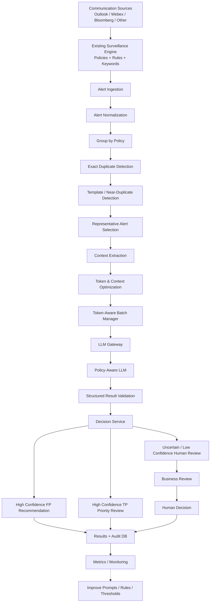

# False Positive Detection

Absolutely. I’ve expanded it into a **complete architecture/design document**, not just the high-level diagram.

### What is included

The package now contains:

```text
false-positive-detection-design-v2/
│
├── README.md
│
├── docs/
│   └── implementation-blueprint.md
│
├── diagrams/
│   ├── 01-end-to-end.mmd
│   ├── 02-duplicate-detection.mmd
│   ├── 03-context-extraction.mmd
│   ├── 04-batching.mmd
│   ├── 05-llm-sequence.mmd
│   ├── 06-human-feedback.mmd
│   └── 07-deployment.mmd
│
└── GITHUB_COMMIT_GUIDE.md
```

The `README.md` now covers the complete flow:

1. Existing surveillance alert ingestion
2. Alert normalization
3. Policy grouping
4. Exact duplicate detection
5. Template/near-duplicate detection
6. Representative message selection
7. Alert-context extraction
8. Policy context management
9. Token-aware LLM batching
10. LLM Gateway
11. Policy-aware LLM prompt
12. Structured JSON response
13. Response validation
14. Decision routing
15. Human review
16. Duplicate result propagation
17. Database design
18. Asynchronous processing
19. Python project structure
20. Failure/retry handling
21. Security considerations
22. Monitoring and metrics
23. Human feedback loop
24. Future optimization

I've also included the **actual Mermaid source** for all the important diagrams, so you can commit the `.mmd` files directly to GitHub.

### Download

[Download the complete GitHub-ready design package](sandbox:/mnt/data/false-positive-detection-design-v2.zip)

### The main architecture is now



### One important architectural decision

I have intentionally finalized this **without embeddings/vector DB**.

The initial solution is:

**cheap deterministic processing → reduce duplicates → extract relevant context → batch → LLM semantic classification → human review**

rather than:

**embeddings → vector search → clustering → LLM**

I think this is the cleaner architecture for your current requirements, and the document explicitly explains why.

The next natural step would be to turn this HLD into an **LLD**, including the actual PostgreSQL schema, Python classes/interfaces, duplicate-detection implementation, context extraction algorithm, batch manager algorithm, and the exact LLM prompt/JSON schema.

